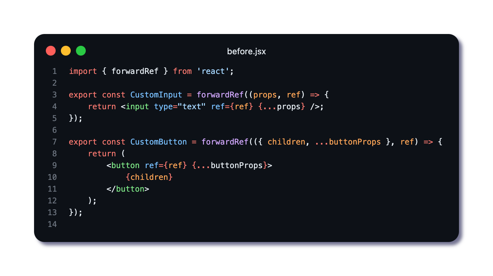
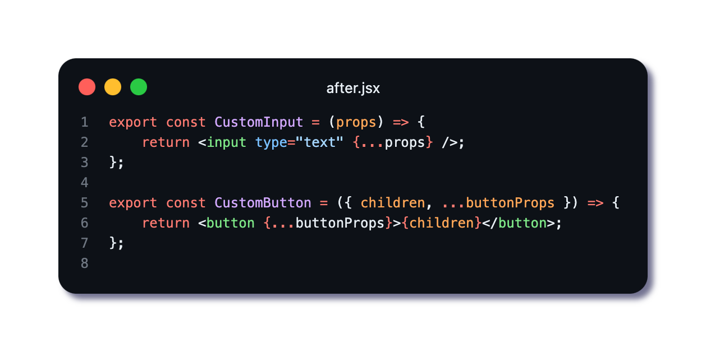

🚀 𝗥𝗲𝗮𝗰𝘁 𝟭𝟵: 𝗥𝗲𝗳𝘀 𝗝𝘂𝘀𝘁 𝗚𝗼𝘁 𝗦𝗶𝗺𝗽𝗹𝗲𝗿!

𝗣𝗿𝗼𝗯𝗹𝗲𝗺: forwardRef creates verbose boilerplate code that's hard to maintain ⚠️
𝗦𝗼𝗹𝘂𝘁𝗶𝗼𝗻: React 19 automatically forwards refs without extra wrapper components 🧩

𝗕𝗲𝗳𝗼𝗿𝗲: Components wrapped in forwardRef with manual ref handling
𝗔𝗳𝘁𝗲𝗿: Clean component definitions with automatic ref forwarding

✅ 𝗔𝘂𝘁𝗼𝗺𝗮𝘁𝗶𝗰 𝗥𝗲𝗳𝘀 – React 19 forwards refs to DOM elements automatically
✅ 𝗟𝗲𝘀𝘀 𝗕𝗼𝗶𝗹𝗲𝗿𝗽𝗹𝗮𝘁𝗲 – No need to wrap components in forwardRef
✅ 𝗖𝗹𝗲𝗮𝗻𝗲𝗿 𝗖𝗼𝗱𝗲 – Simpler, more maintainable component definitions
✅ 𝗘𝗦𝗟𝗶𝗻𝘁 𝗦𝘂𝗽𝗽𝗼𝗿𝘁 – "@eslint-react/no-forward-ref" helps migration

💡 𝗡𝗼𝘁𝗲: Use the ESLint rule's automatic codemod to modernize your codebase

