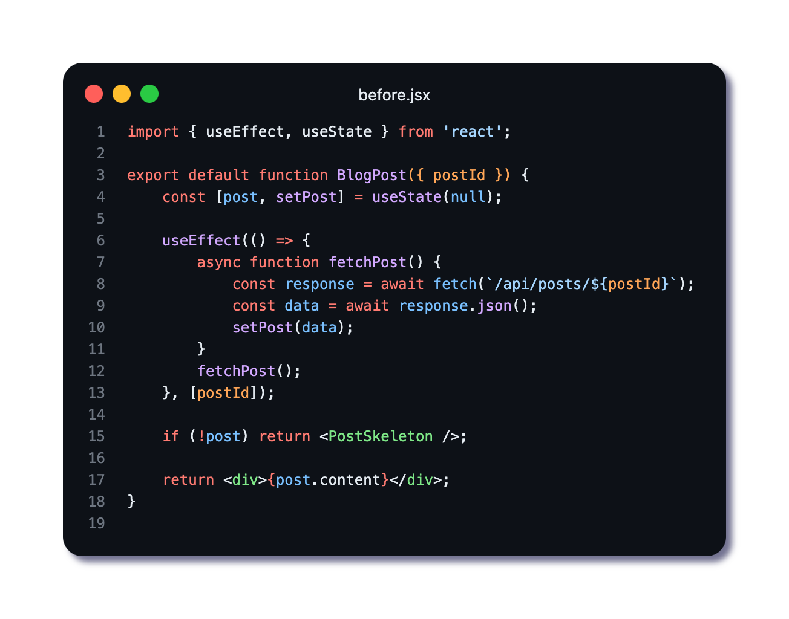
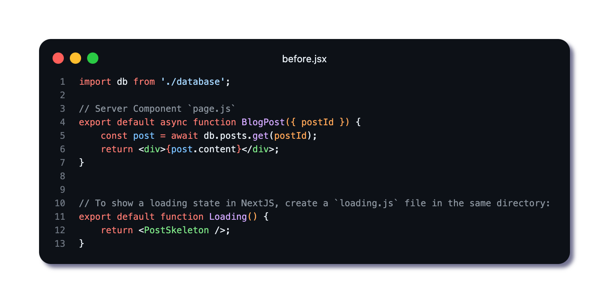

🚀 𝗥𝗲𝗮𝗰𝘁 𝗦𝗲𝗿𝘃𝗲𝗿 𝗖𝗼𝗺𝗽𝗼𝗻𝗲𝗻𝘁𝘀: 𝗙𝗮𝘀𝘁𝗲𝗿 𝗟𝗼𝗮𝗱𝘀 & 𝗦𝗶𝗺𝗽𝗹𝗲𝗿 𝗖𝗼𝗱𝗲

𝗣𝗿𝗼𝗯𝗹𝗲𝗺: Client-side data fetching leads to loading states and client-side JavaScript overhead

𝗦𝗼𝗹𝘂𝘁𝗶𝗼𝗻: Server Components execute on the server during render 🖥️⚡

𝗕𝗲𝗳𝗼𝗿𝗲: Client-side fetching with useEffect 😓
𝗔𝗳𝘁𝗲𝗿: Server-side data fetching in component 🤯✨

✅ 𝗡𝗼 𝗖𝗹𝗶𝗲𝗻𝘁-𝗦𝗶𝗱𝗲 𝗟𝗼𝗮𝗱𝗶𝗻𝗴 - Data fetched before component renders
✅ 𝗦𝗺𝗮𝗹𝗹𝗲𝗿 𝗖𝗹𝗶𝗲𝗻𝘁 𝗕𝘂𝗻𝗱𝗹𝗲 - Logic stays on server

ℹ️ Requires React Server Components support (Next.js 13+)
