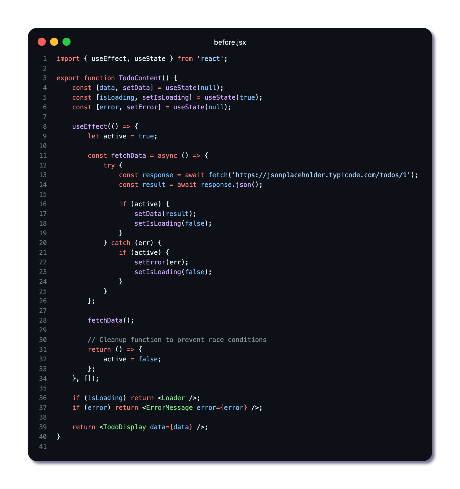
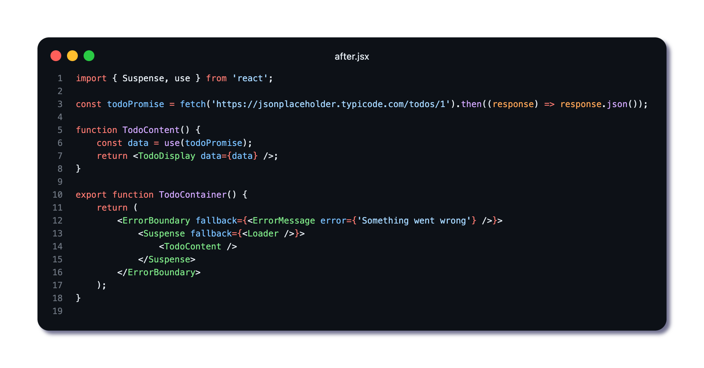

🚀 𝗥𝗲𝗮𝗰𝘁 𝗨𝘀𝗲() 𝗛𝗼𝗼𝗸: 𝗦𝗶𝗺𝗽𝗹𝗶𝗳𝗶𝗲𝗱 𝗣𝗿𝗼𝗺𝗶𝘀𝗲 𝗠𝗮𝗻𝗮𝗴𝗲𝗺𝗲𝗻𝘁

𝗣𝗿𝗼𝗯𝗹𝗲𝗺: Data fetching with useEffect creates verbose, hard-to-maintain code ⚠️  
𝗦𝗼𝗹𝘂𝘁𝗶𝗼𝗻: Synchronously resolve promises in render phase 🧩

𝗕𝗲𝗳𝗼𝗿𝗲: Complex useState/useEffect patterns with manual loading states and cleanup.
𝗔𝗳𝘁𝗲𝗿: Single line `𝘶𝘴𝘦(𝘱𝘳𝘰𝘮𝘪𝘴𝘦)` with Suspense for loading states.

✅ 𝗖𝗹𝗲𝗮𝗻𝗲𝗿 𝗖𝗼𝗱𝗲 – No state variables or effect cleanup needed  
✅ 𝗦𝘆𝗻𝗰𝗵𝗿𝗼𝗻𝗼𝘂𝘀 𝗦𝘆𝗻𝘁𝗮𝘅 – Write async code like synchronous logic  
✅ 𝗗𝗿𝗮𝘀𝘁𝗶𝗰 𝗖𝗼𝗱𝗲 𝗥𝗲𝗱𝘂𝗰𝘁𝗶𝗼𝗻 – From 30+ lines to just a few lines of code
✅ 𝗥𝗮𝗰𝗲 𝗖𝗼𝗻𝗱𝗶𝘁𝗶𝗼𝗻 𝗣𝗿𝗼𝗼𝗳 – Automatic request cancellation

💡 𝗡𝗼𝘁𝗲: Requires Suspense boundary for loading states and Error Boundary for error handling

