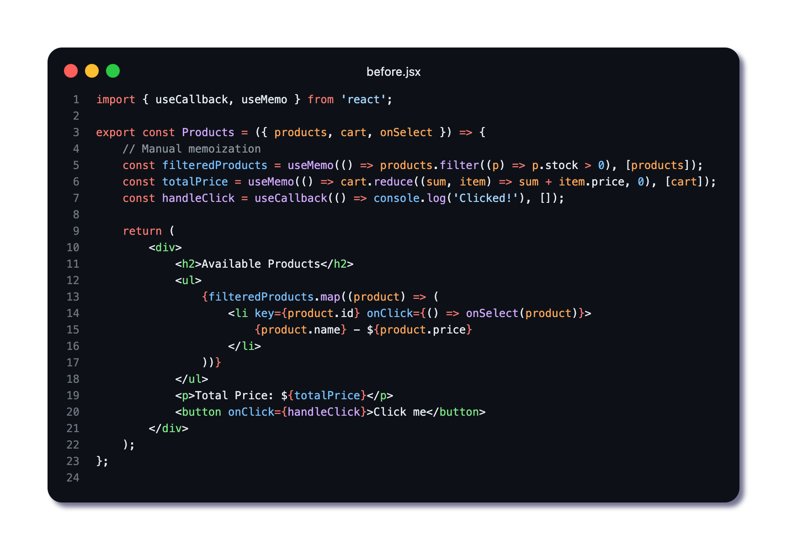
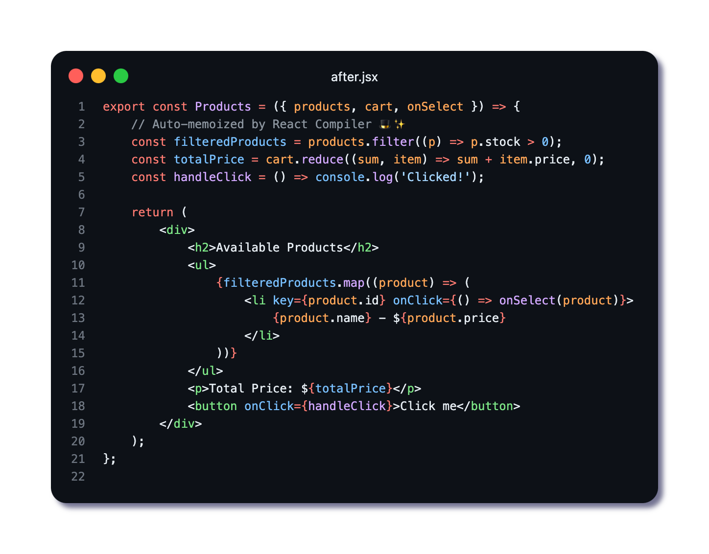

🚀 𝗔𝘂𝘁𝗼-𝗠𝗲𝗺𝗼𝗶𝘇𝗮𝘁𝗶𝗼𝗻 𝗶𝗻 𝗥𝗲𝗮𝗰𝘁 𝗖𝗼𝗺𝗽𝗶𝗹𝗲𝗿: 𝗟𝗲𝘀𝘀 𝗖𝗼𝗱𝗲, 𝗠𝗼𝗿𝗲 𝗣𝗲𝗿𝗳𝗼𝗿𝗺𝗮𝗻𝗰𝗲

𝗣𝗿𝗼𝗯𝗹𝗲𝗺: Manually optimizing with useMemo & useCallback leads to bloated code and hidden bugs.

𝗦𝗼𝗹𝘂𝘁𝗶𝗼𝗻: React Compiler optimizes automatically!

𝗕𝗲𝗳𝗼𝗿𝗲: Manual memoization everywhere 😵‍💫

𝗔𝗳𝘁𝗲𝗿: Auto-memoization does the work 🎩✨ (𝘚𝘦𝘦 𝘪𝘮𝘢𝘨𝘦𝘴 𝘧𝘰𝘳 𝘵𝘩𝘦 𝘤𝘰𝘥𝘦)

✅ 𝗟𝗲𝘀𝘀 𝗕𝗼𝗶𝗹𝗲𝗿𝗽𝗹𝗮𝘁𝗲 - No more overused useMemo & useCallback

✅ 𝗦𝗺𝗮𝗿𝘁𝗲𝗿 𝗗𝗲𝗽𝗲𝗻𝗱𝗲𝗻𝗰𝘆 𝗧𝗿𝗮𝗰𝗸𝗶𝗻𝗴 - React Compiler handles dependencies for you

✅ 𝗕𝗲𝘁𝘁𝗲𝗿 𝗥𝗲𝗮𝗱𝗮𝗯𝗶𝗹𝗶𝘁𝘆 & 𝗠𝗮𝗶𝗻𝘁𝗮𝗶𝗻𝗮𝗯𝗶𝗹𝗶𝘁𝘆

